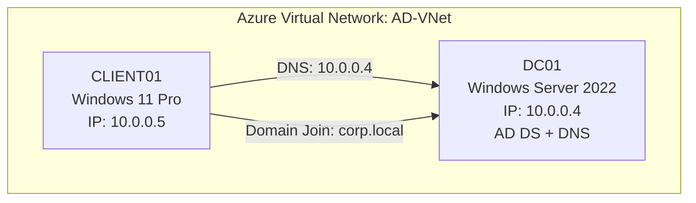

# Cloud-Based Active Directory Lab (Azure)

In this project, I built and configured a cloud-hosted Active Directory environment in Microsoft Azure to mirror a real-world enterprise infrastructure. I deployed a Domain Controller, domain-joined a Windows 11 client workstation, managed custom DNS resolution, and handled user provisioning and authentication.

This hands-on project allowed me to strengthen my practical skills in identity and access management (IAM), Windows Server administration, Azure network routing, and foundational security event analysis.

## Why I Built This Lab

I built this lab to deepen my practical understanding of identity and access management by recreating the core systems used in enterprise environments. Working hands-on with Azure, Active Directory, DNS, and Windows Server allowed me to troubleshoot real-world deployment issues, understand how cloud and on-premise architectures interact, and gain confidence using key SOC and IT operations tools.

---

## Tools Used

#### Platforms & Infrastructure

#### Operating Systems & Server Roles

#### Client Tools

---

## Architecture Overview

### Azure Resources
- **Resource Group:** `AD-Lab`
- **Virtual Network:** `AD-VNet` (Region: Australia East)
- **Custom DNS:** `10.0.0.4` (Domain Controller)

### Virtual Machines

#### 1. DC01 — Windows Server 2022 Datacenter Azure Edition
- **Private IP:** `10.0.0.4` (Static)
- **Roles:** Active Directory Domain Services (AD DS), DNS
- **Domain:** `corp.local`
- **DNS Zones:** `corp.local`, `msdcs.corp.local`
- Promoted to Domain Controller using Server Manager and AD DS role installation.

#### 2. CLIENT01 — Windows 11 Pro
- **Private IP:** `10.0.0.5`
- **DNS:** Configured to point to `10.0.0.4` (DC01)
- Successfully joined to the `corp.local` domain.

### Network Diagram

---

## Active Directory Configuration

### Organizational Structure
- **Organizational Unit:** `TestUsers`
- **User Accounts:**
  - `Alice`
  - `Bob`
  - `Charlie`

### Account Management
- Passwords configured and reset via Active Directory Users and Computers (ADUC).
- `Alice` added to the local **Remote Desktop Users** group on CLIENT01.
- Domain login validated on CLIENT01 using `corp\alice` and confirmed with `whoami`.

## Troubleshooting & Resolutions

### 1. Dynamic Private IP on DC01
* **The Issue:** Azure assigns dynamic private IPs by default, which breaks Domain Controller reliability and DNS stability.
* **My Resolution:** I reconfigured the Network Interface Card (NIC) settings for `DC01` within Azure to assign a static private IP (`10.0.0.4`).

### 2. Client Unable to Join Domain
**Observed symptoms:**
- Connection-specific DNS suffix: `reddog.microsoft.com`
- `whoami` returned `client01\azureuser` instead of domain credentials.
- Domain join attempts failing or not resolving `corp.local`.

**Root Cause:**  
CLIENT01 was using Azure’s default DNS instead of my Domain Controller.

**Resolution:**  
1. I manually updated `CLIENT01`'s network adapter settings to point to `10.0.0.4`.
2. I updated the `AD-VNet` DNS settings in the Azure portal to ensure custom DNS inheritance across the virtual network.

### 3. RDP Login Defaulting to Local VM Account
* **The Issue:** Windows RDP automatically attempted to authenticate using the local admin account (`azureuser`), preventing domain user login.
* **My Resolution:** I used *“More choices → Use a different account”* in the RDP interface to explicitly authenticate using domain credentials (`corp\alice`). 

---

## Outcome

The environment operates as a functional Active Directory domain hosted in Azure:

- Domain authentication and DNS resolution are working as expected.
- CLIENT01 is successfully joined to `corp.local`.
- User provisioning and domain logon for accounts like `corp\alice` are validated.
- The lab provides a realistic foundation for identity management and future security monitoring exercises.

---
## Lessons Learned

| Topic | Lesson |
|-------|--------|
| DNS Is the Foundation of Active Directory | Active Directory relies heavily on DNS for domain discovery, authentication, and service location. A single incorrect DNS setting on the client prevented domain join, authentication, and proper identity resolution. |
| Static IPs Are Critical for Domain Controllers | Azure assigns dynamic private IPs by default, but domain controllers must have static IPs. Without a static IP, DNS records and domain services become unstable. Setting DC01 to a static IP ensured consistent domain availability. |
| Azure Defaults Can Conflict With Enterprise Requirements | Azure automatically applies its own DNS (`reddog.microsoft.com`) unless overridden. Understanding how Azure VNet DNS and NIC-level DNS interact was key to making the environment behave like a real enterprise network. |
| RDP Authentication Behavior Matters | Azure’s RDP login defaults to the local VM admin account. Learning how to switch to domain credentials (“More choices → Use a different account”) was essential for validating domain logins and testing user access. |
| Troubleshooting Through Symptoms Builds Real Skill | Wrong DNS suffix, failed domain join, and incorrect `whoami` output all pointed to the root cause.|

---

## Key Skills Demonstrated

* **Active Directory Deployment:** Installed AD DS, promoted domain controllers, created domain structures (`corp.local`), and managed DNS zones.
* **Cloud Infrastructure Management:** Configured Azure VNets, static IP allocation, custom DNS settings, and VM resource allocation.
* **Identity & Access Control:** Managed OUs, users, group memberships, and Remote Desktop privileges.
* **System Administration & Triage:** Used Server Manager, ADUC, and CLI commands to troubleshoot domain join failures and network misconfigurations.

---

## Project Scorecard

### **Overall Score**

